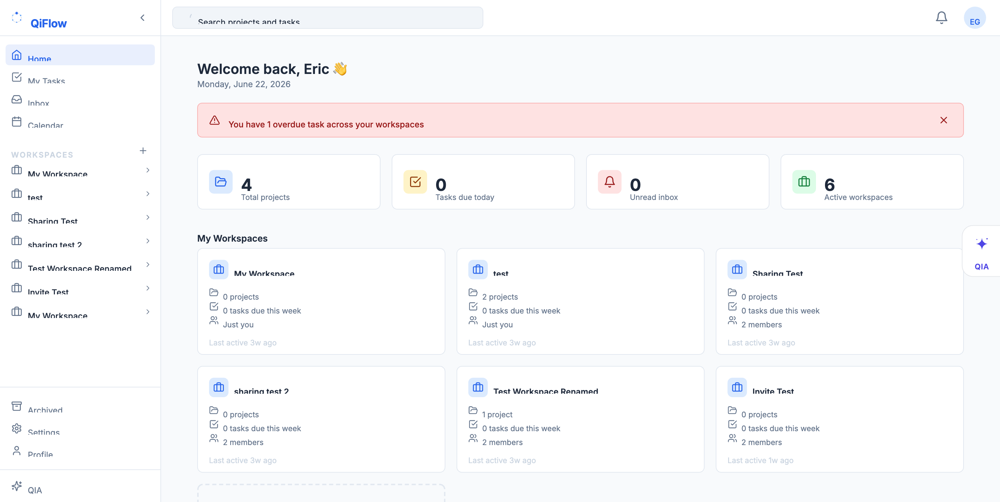
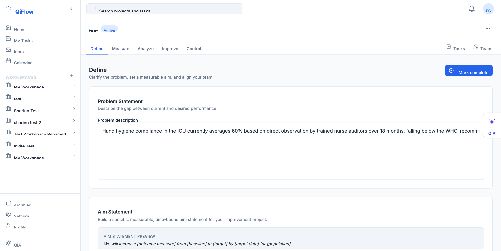
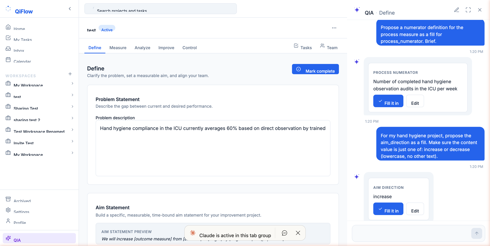
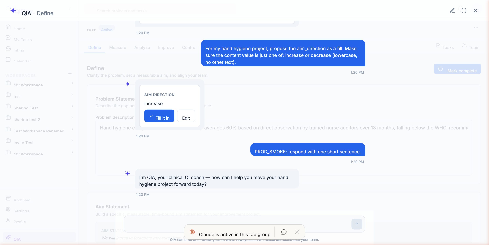

# QiFlow

**A clinician-friendly DMAIC workspace for healthcare QI teams, with an embedded AI coach.**

Live demo: **[qiflow.health](https://qiflow.health)**

QiFlow guides clinical Quality Improvement teams through the full DMAIC cycle — Define, Measure, Analyze, Improve, Control — in one structured workspace. **QIA**, the built-in AI assistant, gives phase-aware coaching, drafts content for measures and aim statements, and proposes field fills the team can accept with one click.

### Features

- **DMAIC workspace** — problem statements, aim builder, measure definitions, fishbone, 5 Whys, PDSA cycles, control plans
- **QIA assistant** — streaming AI chat with phase-specific agents and one-click field fills (per-user history, membership-gated)
- **Team collaboration** — workspaces, projects, invitations, tasks, in-app inbox
- **PubMed integration** — pulls relevant clinical literature into the QI context

### Stack

Next.js 14 · TypeScript · Tailwind · Supabase (Postgres + RLS + Auth) · Anthropic Claude · Vercel

### Screenshots

---

*Source code is private. This repo exists to showcase the project.*
